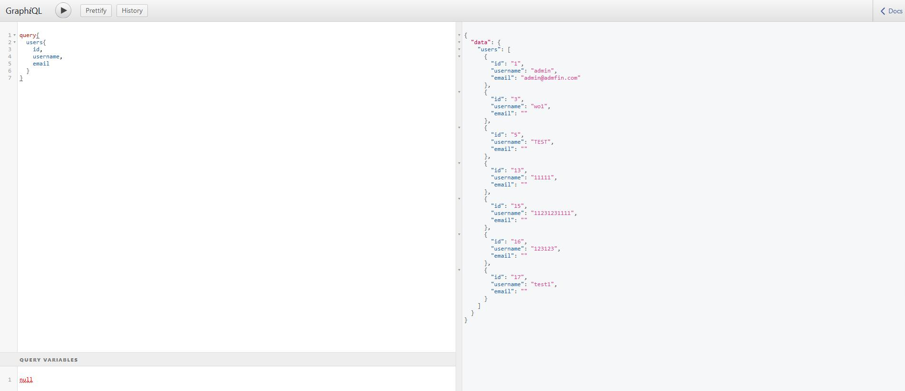

# 海豹  


> django-base-templastes

> 因本项目开始时间为3月1日,是 国际海豹日,故项目起名为  海豹 seal 

> 主要为 django 基础开发平台, MVC 模式 开发.支持 非前后端分离 和 前后端分离模式,可以拿来参考 开发 django项目

> 支持 RESETful 和 GraphQL

>  vue 前端地址 https://github.com/hequan2017/seal-vue 持续开发中

> 作者会在周末进行开发、更新。


## 介绍
* 基于bootstrap4+django2.1+python3.6+celery4 异步任务
* 前端模板 inspinia 2.9 
* 采用cbv开发方式
* drf api 例子
* 前端 Vue版本
* GraphQL


## DEMO





## templates

* base      网页基本模板
* system    平台基本网页(首页/登录/修改密码)
* assets    资产管理  (增删改查例子)
* document  代码规范


## GraphQL
> 具体代码 请参考  seal/schema.py

> 请求地址 :  http://localhost/graphql

> GraphQL 请求参数
```
query{
  users{
    id,
    username,
    email
  }
}

mutation createUser {
 createUser (username: "test1") {
     info {
         id,
     },
     ok
 }
}

mutation updateUser {
 updateUser (pk:2,username: "test2") {
     info {
         id,
     },
     ok
 }
}

mutation deleteUser {
 deleteUser (pk:2) {
     ok
 }
}
```


## 部署

```bash
yum install  python-devel mysql-devel  -y

git clone https://github.com/hequan2017/seal
cd seal
python install -r requirements.txt
python manage.py makemigrations
python manage.py migrate
python manage.py createsuperuser


python manage.py  runserver 0.0.0.0:80

```

## 异步任务
* 扩展功能-异步1   推荐 定时任务用celery
```bash
#需要安装redis
#启动celery异步任务
cd seal
celery  -B   -A  seal  worker  -l  info
```

* 扩展功能-异步2   普通异步任务 用  dramatiq
```bash
cd system/decorator/asynchronous/
dramatiq  asynchronous  --watch  .  --log-file  /tmp/dramatiq.log

```


##  注意
* 如果想直接拿来做生产项目,请重新生成一个 settings 文件里面的 SECRET_KEY 
* 时区问题
```python
##因为开启了时区,所以django在数据库里面保存的为 utc 时间, 调用的时候会帮你 转为 东八区, celery会自动识别时间
from django.utils import timezone
for i in Users.objects.all():
    print(i.last_login)  ## 直接读取时间,会是 utc时间,未转换, 如果需要处理 请注意
    print(timezone.localtime(i.last_login).strftime("%Y-%m-%d %H:%M:%S"))  ## 时间格式化为 正常时间
    
## 2019-03-05 06:41:18.040809+00:00
## 2019-03-05 14:41:18

```


## 售后服务

* bootstrap4 中文文档  https://code.z01.com/v4/
* cbv 中文文档  http://ccbv.co.uk/projects/Django/2.1/django.views.generic.edit/
* GraphQL   中文参考文档  https://passwo.gitbook.io/graphql/index/drf

### 其他
* 有问题 可以加QQ群： 620176501  <a target="_blank" href="//shang.qq.com/wpa/qunwpa?idkey=bbe5716e8bd2075cb27029bd5dd97e22fc4d83c0f61291f47ed3ed6a4195b024"></a>
* 欢迎提出你的需求和意见,或者来加入到本项目中一起开发。

### 作者
* 何全 

